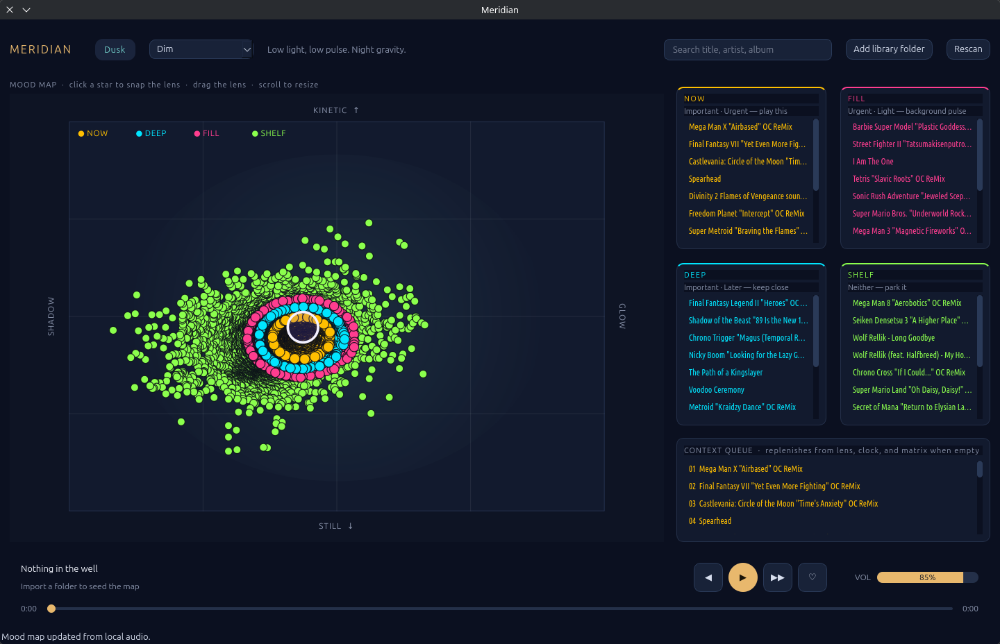
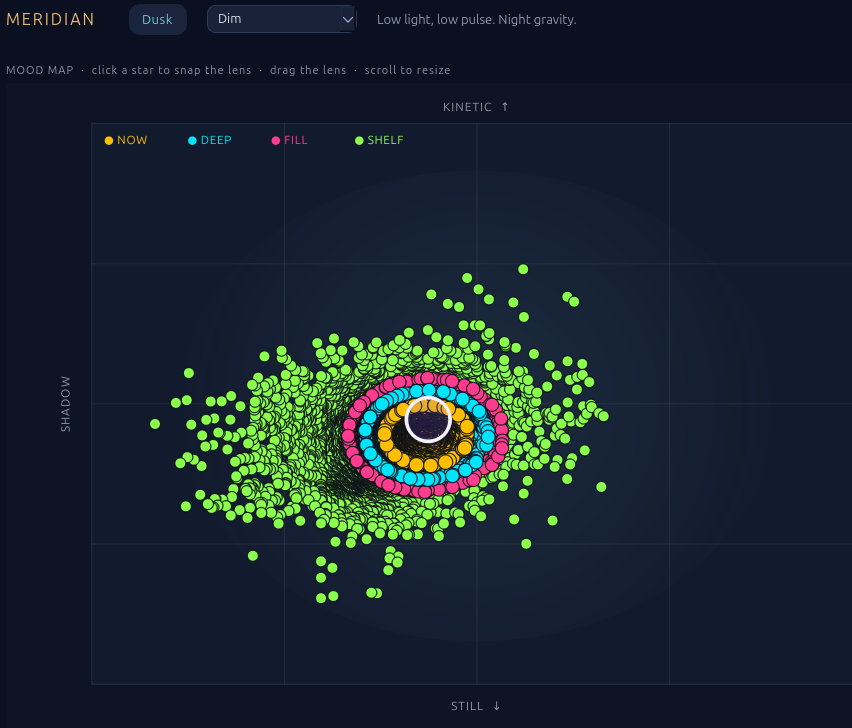
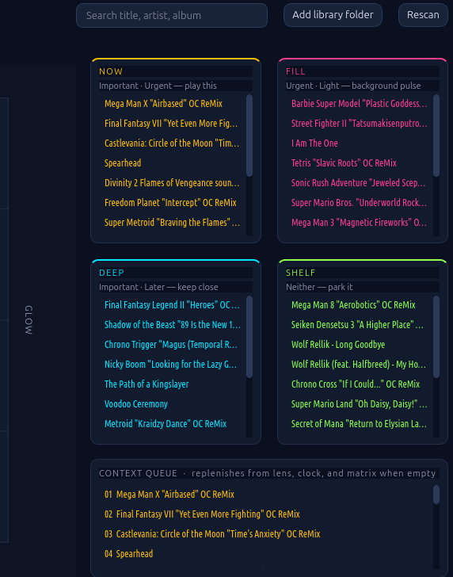

# Meridian

**Find music by feeling — not by folders.**

Meridian is a local, offline Linux music player that places your library on a living **mood map**. Point a lens at the mood you want. Meridian fills an Eisenhower-style listen matrix and a context queue around that feeling, the time of day, and how you play.

No accounts. No streaming. Your files stay on disk.



<p align="center">
  
  &nbsp;
  
</p>

## Why Meridian

Most players ask *what album next*. Meridian asks *where do you want to be*.

- **Shadow → Glow** — darker to brighter emotional color  
- **Still → Kinetic** — calm to driving energy  
- A **lens** you drag and resize chooses the neighborhood the queue pulls from  
- Stars you move stay **pinned** so your sense of a track can override the analysis  

Under the hood, Meridian reads tags, samples short waveforms (via `ffmpeg`), and uses **aubio** for tempo and onset cues so placements stay musical without a cloud model.

## How listening works

### Mood map
Every track is a star on the map. Click a star to snap the lens. Scroll to tighten or widen the pull radius — a smaller lens means a stricter matrix and queue.

### Eisenhower listen matrix

| | Fits the lens *now* | Not urgent |
|---|---|---|
| **Important** | **NOW** — play this | **DEEP** — keep close |
| **Not important** | **FILL** — background pulse | **SHELF** — park it |

Importance comes from mood fit, loves, and play history. Urgency comes from the lens, clock band, skips, and tracks you pull in by hand.

### Context queue
The queue replenishes from the lens, clock, and matrix when it runs dry. Modes shape the gravity:

| Mode | Intent |
|---|---|
| **Focus** | Steady mid-energy, fewer surprises |
| **Wander** | Follow the map |
| **Charge** | High kinetic bias |
| **Dim** | Low light, low pulse — night gravity |

Clock bands (**Dawn / Day / Dusk / Night**) nudge the target without overriding the lens you set.

## Get Meridian

### AppImage (recommended)

Download the latest build from [Releases](https://github.com/dark1ltg/Meridian/releases):

```bash
chmod +x Meridian-x86_64.AppImage
./Meridian-x86_64.AppImage
```

Install **`ffmpeg`** on the host for mood analysis. Playback uses Qt Multimedia.

### Run from source

Needs system PySide6 (Qt 6) plus a venv for analysis libraries:

```bash
/usr/bin/python3 -m venv --system-site-packages .venv
.venv/bin/python -m pip install mutagen numpy aubio
bash scripts/run.sh
```

`aubio` needs the native library (e.g. Arch/CachyOS: `sudo pacman -S aubio`). Without it, Meridian still runs; tempo/onset features are skipped.

Add folders with **Add library folder**. `~/Music` is scanned on first launch if it exists. **Rescan** force-refreshes tags and re-analyzes every track in your library folders.

### Build the AppImage yourself

```bash
bash packaging/build-appimage.sh
```

Output: `dist/Meridian-$(uname -m).AppImage`

## Shortcuts

| Key | Action |
|---|---|
| Space | Play / pause |
| Ctrl+Left / Ctrl+Right | Previous / next |
| Double-click star, matrix row, or queue row | Play |
| Heart (transport) | Mark a track important |

## License

Meridian is free software under the **GNU General Public License v3.0**.  
See [LICENSE](LICENSE) / [COPYING](COPYING).

Third-party components are listed in [THIRD_PARTY_NOTICES.txt](THIRD_PARTY_NOTICES.txt).  
Ubuntu fonts ship under the Ubuntu Font Licence 1.0 in `resources/fonts/`.  
AppImage builds include these texts under `usr/share/doc/meridian/` with [SOURCE_OFFER.txt](SOURCE_OFFER.txt).
